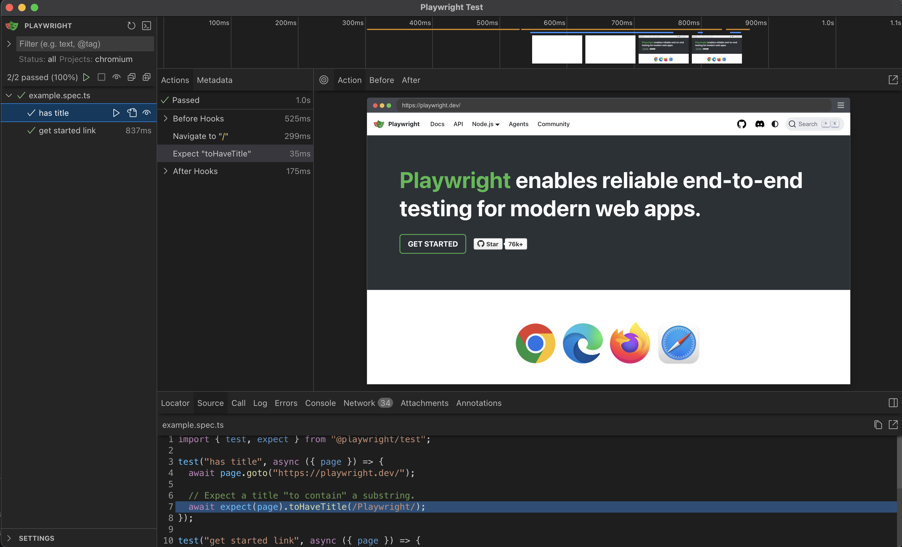

안녕하세요.

프론트엔드하면서 부끄럽게도 테스트코드 작성이라는걸 말만 들어봤지 해본적이 없네요.

부끄럽네요 ㅋ 이 포스팅은 아마 제가 Playwright 를 탐구하는 글이 될것같네요 ㅎ

# Playwright 란?

**Playwright** 는 오픈소스 프레임워크로, E2E 테스트를 위한 도구입니다.

다양한 언어를 지원하구요. (TypeScript, JavaScript, Python, .NET, Java)

모바일 웹 테스트도 된다고합니당. 이외에 여러가지 특징들이 있지만, 우선 저는 알못이기때문에 그냥 기초적인 정도만 서술해보려고합니다.

저는 일단 프로젝트를 새로 만들어서 해보기로했어요.

# 프로젝트 생성 및 Playwright 설치

> 저는 pnpm을 주로 사용하고 있어서 패키지를 설치할 때 pnpm을 사용할거에요!

```bash
pnpm create vite
```

일단 vite react 프로젝트를 생성해용.

```bash
Project Name : react-playwright
Select a framework : React
Select a variant : TypeScript
```

저는 위와같이 선택하고 프로젝트를 만들었습니당.

이제 playwright도 설치해염.

리액트 프로젝트 디렉토리로 이동 후 다음 명령어 입력

```bash
pnpm create playwright
```

위 명령어를 입력하면 나오는 프롬프트에서는 다음과 같이 선택했습니다.


조금 기다리면 설치가 끝나염.

설치가 끝나면 다음과 같은 파일들이 생기는데여.

```
playwright.config.ts         # playwright 설정파일
package.json
package-lock.json            # Or yarn.lock / pnpm-lock.yaml
tests/
  example.spec.ts            # 간단한 예제 테스트 파일
tests-examples/
  demo-todo-app.spec.ts      # 더 복잡한 예제 테스트 파일
```

간단한 예제 테스트 파일을 한번 살펴보겠습니다.

```ts
import { test, expect } from "@playwright/test"

test("has title", async ({ page }) => {
  await page.goto("https://playwright.dev/")

  // Expect a title "to contain" a substring.
  await expect(page).toHaveTitle(/Playwright/)
})

test("get started link", async ({ page }) => {
  await page.goto("https://playwright.dev/")

  // Click the get started link.
  await page.getByRole("link", { name: "Get started" }).click()

  // Expects page to have a heading with the name of Installation.
  await expect(
    page.getByRole("heading", { name: "Installation" })
  ).toBeVisible()
})
```

`test` 와 `expect` 함수를 import 해서 사용하고있네요.

아마도 `test` 함수는 테스트 케이스를 정의하고, `expect` 함수는 테스트 결과를 확인하는 함수일 것 같네요.

우선 테스트를 실행하는 명령어부터 실행해보겠습니다.

# 테스트 예제 실행

```bash
pnpm exec playwright test
```

저는 다음과 같은 결과가 나왔습니다.


이미지에 적혀있는 `pnpm exec playwright show-report` 명령어를 실행해서 리포트를 확인해볼게요.

# 테스트 REPORT 확인

```bash
pnpm exec playwright show-report
```


오.. 실행한 테스트에 대한 자세한 내용을 보여주는 웹 브라우저가 나타납니다.

webkit, firefox, chromium 세 개 브라우저 환경에서 테스트를 실행했네요.

목록에서 하나를 클릭해서 상세하게 내용을 확인해볼게요.


테스트 절차에 대해서 자세하게 내용을 확인할 수 있습니당.

# UI 모드

공식문서를 살펴보니 테스트 결과를 웹 브라우저 UI로 확인할 수 있는 모드가 있습니다?

```bash
pnpm exec playwright test --ui
```

위 명령어를 통해 ui모드로 테스트를 할 수 있어요.

ui 모드로 테스트를 실행하면, 브라우저가 하나 실행되고 다음과 같은 이미지로 나타납니당.



직접 브라우저를 보면서, 테스트 코드가 어떻게 진행되는지 확인할 수 있어서 좋은것같네여.

<hr />

# 마무리하며

요번 글에서는 대충 프로젝트 만들고 Playwright 깔고 playwright로 어떻게 테스트를 진행하는지 정도 확인해봤구여.

앞으로도 공식문서를 따라가면서 공부하면서 기록할것같네요.

감사합니당.
