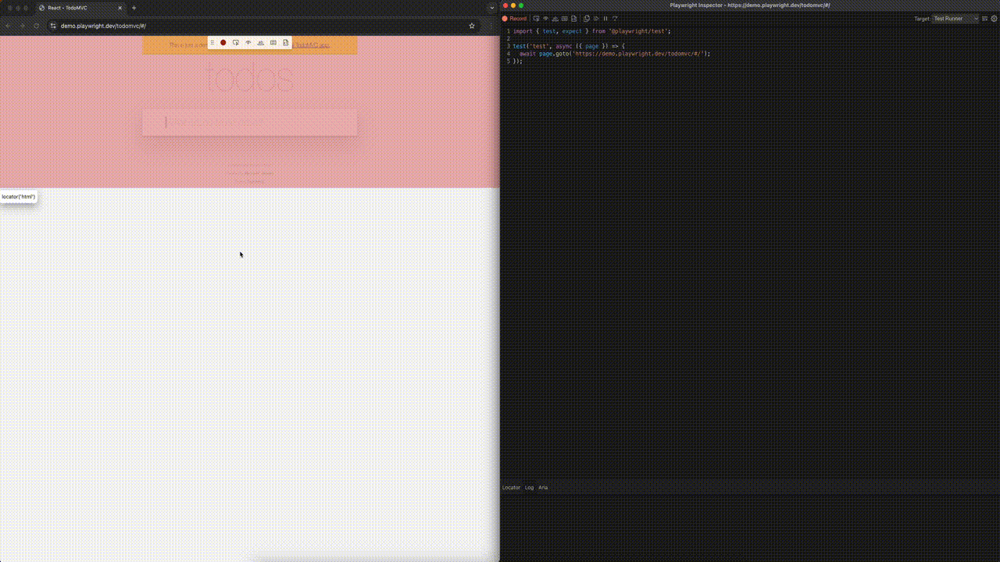

# Generating tests

playwright는 테스트를 자동으로 생성할 수 있는 기능을 제공함미다.

이게 뭐냐면 직접 개발자가 UI를 만지작거리면, 해당 동작이 코드로 자동으로 생성되는거에요.

되게 신기하지않나요? 테스트를 처음 만들때 유용할 것 같습니다.

## 하는법

하는법은 아주 간단합니다.

```bash
npx playwright codegen demo.playwright.dev/todomvc
```

요렇게 터미널에 입력하면되는데요. demo.playwright.dev/todomvc 부분에 테스트를 실행할 페이지의 URL을 넣어주면됩니다.

우선 저는 위에꺼 그대로 복붙해서 해보겠습니다.



보시는것처럼 제가 클릭하고, 입력하고 하는 동작이 그대로 코드로 생성되는걸 확인할 수 있습니다.


이건 상단 툴박스인데여.

기본적으로 저렇게 빨간색이 활성화되면 녹화상태이고, 이 때 상호작용하는것들이 코드로 생성되는거에요.
녹화 상태를 끄면 코드 생성 상태를 잠깐 멈출 수 있습니당.

녹화버튼 오른쪽에 여러가지 툴들이 나열되어있는데요.

요거는 assert 와 관련된 코드를 생성해줘요.

요 기능을 활용하면, 좀 더 쉽게 테스트 코드를 작성할 수 있습니다.

상당히 유용한 것 같네요.
