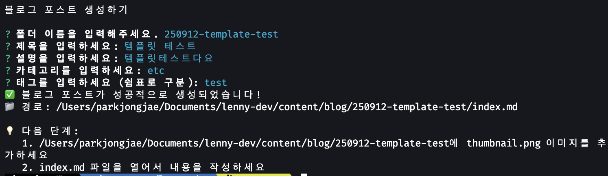
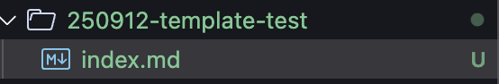
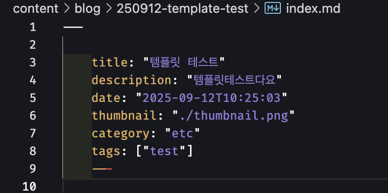

# playwright

요즘 playwright로 테스트를 짜보고있음.

아직은 테스트를 어떻게 짜야하는지 잘 모르기때문에 컴포넌트가 잘 렌더링 됐는지, Form 유효성 검사 실패 시 나타나는 Text가 화면에 잘 나타나는지

서벼 켜놓고 관리자 계정, 일반 유저 계정으로 로그인 했을 시 각각 권한에 맞게 Navigation 메뉴가 보이거나 숨겨지는지.. 아무튼 이런식으로 기존에

내가 작성했던 프로젝트의 기능을 다시 한번 확인하는 느낌으로 작성중임~ 이렇게 짜는게 맞나 모르겠지만 ㅋㅋㅋ.. 정상적으로 동작하는 Action을 기준으로 테스트를 짜고있다!

짜면서 느낀건데, 확실히 테스트 작성 역량이 늘면 좋을 것 같긴하다는걸 느낌. 만약 잘 작동하는 테스트가 갑자기 작동하지않는다거나? 할 때 디버깅도 수월할 것 같고..

여러모로 좋은점이 많은듯.. 테스트 짜면서 기존 코드를 한번 더 점검도 하게되고.. 좋은점이 많은것 같다.

오늘은 describe 랑 beforeEach 훅을 처음 써봤다.

```ts
test.describe("A 페이지 테스트", () => {
  test.beforeEach(async ({ page }) => {
    // 각각의 테스트를 실행하기전에 공통으로 실행 할 테스트 작성
  })

  test("Test 1", async ({ page }) => {})

  test("Test 2", async ({ page }) => {})

  test("Test 3", async ({ page }) => {})
})
```

이런식으로 테스트를 그룹? 지어서 할 수 있음.

test.beforeEach 내부에 나는 로그인 후 특정 페이지로 리다이렉트 하는 로직을 넣었고 (왜냐하면 아래 테스트 3개가 전부 같은 페이지에서 실행되어야 하기 때문)

각각 Test 1, Test 2, Test 3 에는 같은 페이지에서 사용되지만 형상이 다른 Form 컴포넌트들에 대한 테스트코드를 작성했음~

아무튼 describe를 사용해보고 느낀건, 테스트 코드 가독성 향상에 큰 도움이 될 것 같다는 생각이 들었음

# Inquirer.js

요즘 블로그를 하면서.. 새로운 글을 만들때마다 일일히 폴더를 만들고, index.md를 만들고, 본문을 작성하기전에 Header 라고 불러야하나? 아무튼

제목, 설명, 썸네일, 날짜, 카테고리, 태그 등등.. 먼저 적고 시작하는 부분.. 그 부분을 일일히 직접 하는 작업에 엄청난 귀찮음을 느껴버렸다.

그래서 프롬프트로 폴더이름, 제목, 설명, 카테고리.. 등등 위 정보를 입력받은 후 자동으로 파일을 생성하게 하면 좋겠다는 생각이 들었다.

그러면 그냥 편하게 본문만 쓰면되자너?

그래서 어떻게 하는지 찾다가 발견한 라이브러리임.

[Inquirer.js](https://www.npmjs.com/package/@inquirer/prompts)

사용법도 그렇게 어렵지 않다! 관련된 글은 조만간 업로드 할 것 같음여.

아무튼 이걸 이용해서 다음과 같이 할 수 있었음.

```bash
pnpm run create-post
```

라는 명령어를 입력하면 이렇게 프롬프트가 나타나고 정보들을 입력함



아래는 그 결과물들 이미지



옥게~ 폴더도 잘 만들었고.



마크다운 템플릿은 약간 엉성하게 생성됐는데 그래도 만족할만한 수준인듯 ㅎ

이거 쓰고 바로 수정 ㄱㄱ
